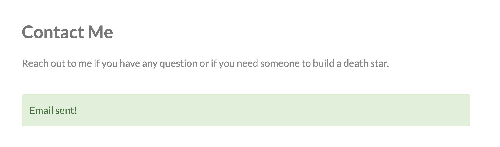
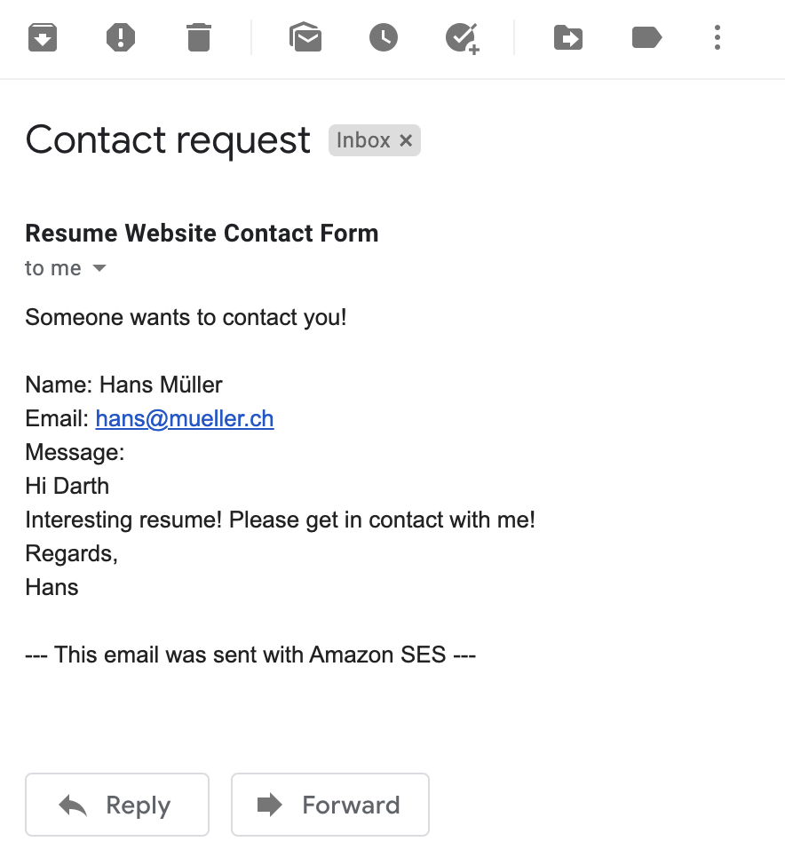

# Introduction

The goal of this lab is to create your very own resume and publish it as a public website. For this you are going to use Azure serverless technologies.

The solution will look similar to the following diagram. You will use Azure Storage static website storage to publish your static site.


Check out the [Darth Vader](https://darthvader.jhnr.ch) example resume website if you want to see it in action.

If you find any ambiguities, errors or typos, please open an issue. Or even better, correct the relevant files and create a pull request 😉

## More information about Cloud and Azure

If you want to get familiar with essential AWS concepts and services. There are plenty of free training sessions available on [AWS training and certification](https://aws.training) or Youtube. You will need a (free) Amazon account for this.

*   [What is Cloud Computing?](https://youtu.be/dH0yz-Osy54) - 5min
*   [What is Microsoft Azure?](https://www.youtube.com/watch?v=KXkBZCe699A) - 5min
*   [Azure Fundamentals part 1: Describe core Azure concepts](https://docs.microsoft.com/en-us/learn/paths/az-900-describe-cloud-concepts/) - 1h

Login with your Azure credentials and get familiar with the [Azure console](https://portal.azure.com).

Let the teacher know if you were able to login and browse the Azure portal. Check out [this guide](https://docs.microsoft.com/en-us/azure/azure-portal/azure-portal-overview) which will help you to get started with the Azure portal.

# Step 1 - Create your HTML resume

First of all you need a resume. Some great examples of static websites built with HTML and CSS can be found [here](https://html5up.net/). All the templates you find there are 100% Free under the [Creative Commons](https://html5up.net/license) license. This means you may use the templates but you need to give HTML5 UP credit for the design. There is a note in the footer section of each template that mentions HTML5 UP and a corresponding comment in the `index.html`file. Please do not remove those attributions or be sure to check out [Pixelarity](https://pixelarity.com/) which offers attribution-free usage of the template in exchange for a small amount of money.

This lab is based on the [Read Only template from HTML5 UP](https://html5up.net/read-only) so it is recommended to use this one. The template is optimized for a personal website and contains a simple contact form which you are going to use later on.

For this lab we will use a a slightly modified version of the above mentioned template and adopt it to represent your resume. You can download this template from [this github repository](darthvader-resume-template/).

The following modifications were added to the template to match the requirements for this lab:
* To make the contact form work, some JavaScript magic which sends the form input to the AWS API Gateway is needed. Therefor a [JavaScript function](darthvader-resume-template/assets/js/contact.js) was added which will post the message from the contact form to your API. The function requires an API endpoint to be available under `<base url>/rest/contact`. You will create this endpoint as part of this lab.
* The [form definition](https://github.com/sjohner/serverless-resume/blob/5d29ea0e909dedb80c385ade0ffcad6da20fd0bd/darthvader-resume-template/index.html#L113) was slightly modified to call the `sendMessage` function when a user submits the form
* [All form fields](https://github.com/sjohner/serverless-resume/blob/5d29ea0e909dedb80c385ade0ffcad6da20fd0bd/darthvader-resume-template/index.html#L115-L118) are configured as required. When present, this attribute specifies that an input field must be filled out before submitting the form
* The `contact.js` JavaScript file containing the `sendMessage` function is [included in the `index.html`file](https://github.com/sjohner/serverless-resume/blob/5d29ea0e909dedb80c385ade0ffcad6da20fd0bd/darthvader-resume-template/index.html#L150)
* The [`form.css`CSS file](https://github.com/sjohner/serverless-resume/blob/main/darthvader-resume-template/assets/css/form.css) containing the formatting for the form success message is [included in the `index.html`file](https://github.com/sjohner/serverless-resume/blob/7370fea8918e44f87db50636cf707c10c716b42a/darthvader-resume-template/index.html#L13)

You might want to add a profile pic and some basic information about you. Adjust the `index.html` file accordingly and replace the images in the `images` folder if you want to. To check out your work you can launch `index.html` in your browser on your local machine.

To modify the template you can use whatever text editor you have. There are plenty of options out there which are free to use. Two great options to use are:

*   [Visual Studio Code](https://code.visualstudio.com/)
*   [Sublime Text](https://www.sublimetext.com/)

Don’t spend too much time on your resume. It just serves as an example and you can still tweak it later on when it is online.

# Step 2 - Deploy your resume online

Deploy your resume online as an [Azure Storage static website](https://docs.microsoft.com/en-us/azure/storage/blobs/storage-blob-static-website).

You might want to complete the following training sessions to get some basic understanding of Azure Storage Storage Service before starting with the actual deployment.

*   [Azure Storage Fundamentals](https://docs.microsoft.com/en-us/learn/modules/azure-storage-fundamentals/) - 30min
*   [Choose a data storage approach in Azure](https://docs.microsoft.com/en-us/learn/modules/choose-storage-approach-in-azure/) - 30min

Whenever you are ready, start creating your resources. You can use [this walkthrough](https://docs.microsoft.com/en-us/azure/storage/blobs/storage-blob-static-website-how-to?tabs=azure-portal) to get started with static website hosting on Azure Storage. The afore mentioned guide requires you to first create an Azure Storage Account. Use [this walkthrough](https://docs.microsoft.com/en-us/azure/storage/common/storage-account-create?tabs=azure-portal) to create an Azure Storage Account.

🚨 Some hints regarding the walkthrough:

*   There is no need to change default settings for Networking, Data protection and Advanced options
*   Use `index.html `and `error.html` for your index and error document.
*   It is easier if you use Azure CLI or PowerShell to upload the website files. This way you can upload entire folders.

Document the resources you created and let the teacher know the Static Website endpoint URL where your resume website is available.

If your resume is available online you can add a custom `error.html` document to further personalize your website.

# Step 3 - Create a SendGrid Account
Now that you published your resume, you need a way to get in contact with you. This is where [SendGrid](https://sendgrid.com) comes into play. SendGrid is a flexible and scalable email service that enables you to send mail from within any application. With the SendGrid free tier you can send up to 100 emails/day for free.

Setting up SendGrid is quite simple:

*   [Create a SendGrid account](https://signup.sendgrid.com/) and verify an email address which you want to use to send your emails. This is probably your own personal email address
*   [Create a SendGrid API key](https://sendgrid.com/docs/ui/account-and-settings/api-keys/). You will need this key to programmatically send emails via SendGrid.
*   [Test your SendGrid API key](https://sendgrid.com/docs/ui/account-and-settings/api-keys/#testing-an-api-key). If everything works as expected you should get an email delivered to your inbox.

# Step 4 - Create your first Azure Function

Deploy an Azure Function to be able to send emails from the website contact form. The documentation [Azure Storage static website](https://docs.microsoft.com/en-us/azure/azure-functions/functions-create-function-app-portal).

You might want to complete the following training sessions to get some basic understanding of Azure Storage Storage Service before starting with the actual deployment.

*   [Introduction to Azure Functions](https://docs.microsoft.com/en-us/azure/azure-functions/functions-overview) - 5min
*   [Choose the best Azure service to automate your business processes](https://docs.microsoft.com/en-us/learn/modules/choose-azure-service-to-integrate-and-automate-business-processes/) - 45min

Whenever you are ready, start creating your resources. You can use [this walkthrough](https://docs.microsoft.com/en-us/azure/azure-functions/functions-create-function-app-portal) to create your first function using the Azure portal. Test the function as outlined in the walkthrough to make sure everything works as expected before continuing with the next steps

# Step 5 - Send email using your Azure Function and SendGrid

You successfully deployed an Azure Function and a SendGrid account. Now it is time to connect those two services to be able to send emails using your Azure Function.

Modify your the existing function so that it can process the form output from your website contact form and send an email using SendGrid. You will need to make the following changes to your Functions

*   Add the [SendGrid output binding](ocs.microsoft.com/en-us/azure/azure-functions/functions-triggers-bindings) to your function. Make sure you use the SendGrid API key generated in the previous steps
*   Instead of using the function code provided in the tutorial, get the [code from this Github repository](https://github.com/sjohner/serverless-resume-lab/blob/main/azure-sendmail.js).
*   Make sure you change the sender and recipient address to match with the email address you registered with SendGrid

Once you changed the function code accordingly, you can test the function with the following input data

```
{
  "name": "Hans Meier",
  "subject": "Anfrage",
  "email": "hans@gmail.com",
  "message": "Hallo Velo"
}
```

🚨 Some hints regarding the walkthrough:

*   Make sure that you use the same parameter name as defined in the SendGrid Output Binding (Message Parameter Name). If you leave it default this should be `message`

# Step 6 - Make the contact form on your website work

You are almost done! Just some minor changes and your are done:

*   Add the URL of your Static Website Storage Account to the `CORS Settings` of your Function App. This is necessary because the function is called from another origin - your resume website. See [What is CORS](https://developer.mozilla.org/en-US/docs/Web/HTTP/CORS) for more detailed information about CORS.
*   Add the URL of your function endpoint to [contact.js](https://github.com/sjohner/serverless-resume/blob/bdf5338c6b8e9e50b92f5d3d871bd5bbe7fb8f77/darthvader-resume-template/assets/js/contact.js#L17) to make sure the correct function is called when a user sends you a message

Now you can test the contact form of your static website.

Fill the form with some sample data and wait for the email to arrive in your inbox. You can use the [Chrome Developer Tools](https://developers.google.com/web/tools/chrome-devtools) to check what is going on when submitting the form.

You should see a nice green success message if your form was submitted successfully.



And in your inbox you should see a new message.



🥳 Congratulations, you successfully completed this lab and created your own resume website based on serverless technologies!

# Bonus tasks

*   [Integrate your static website with Azure CDN](https://docs.microsoft.com/en-us/azure/storage/blobs/static-website-content-delivery-network)
*   [Deploy your static website with Github Actions](https://docs.microsoft.com/en-us/azure/storage/blobs/storage-blobs-static-site-github-actions)
