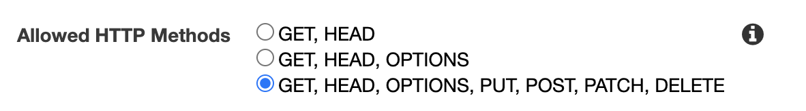
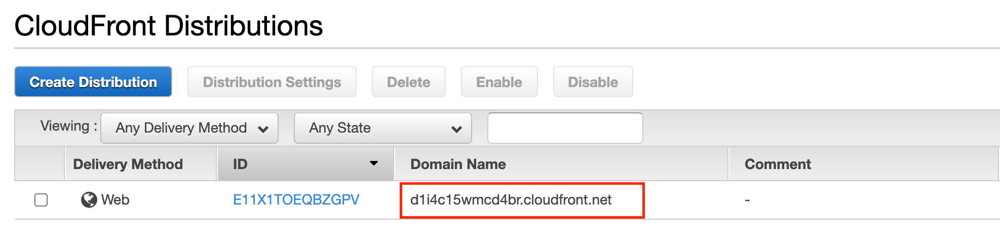
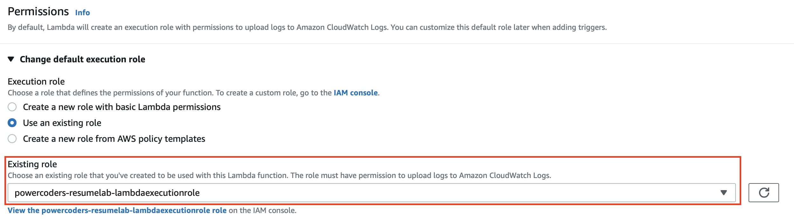
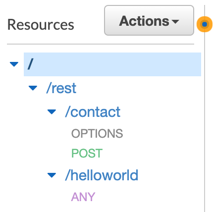
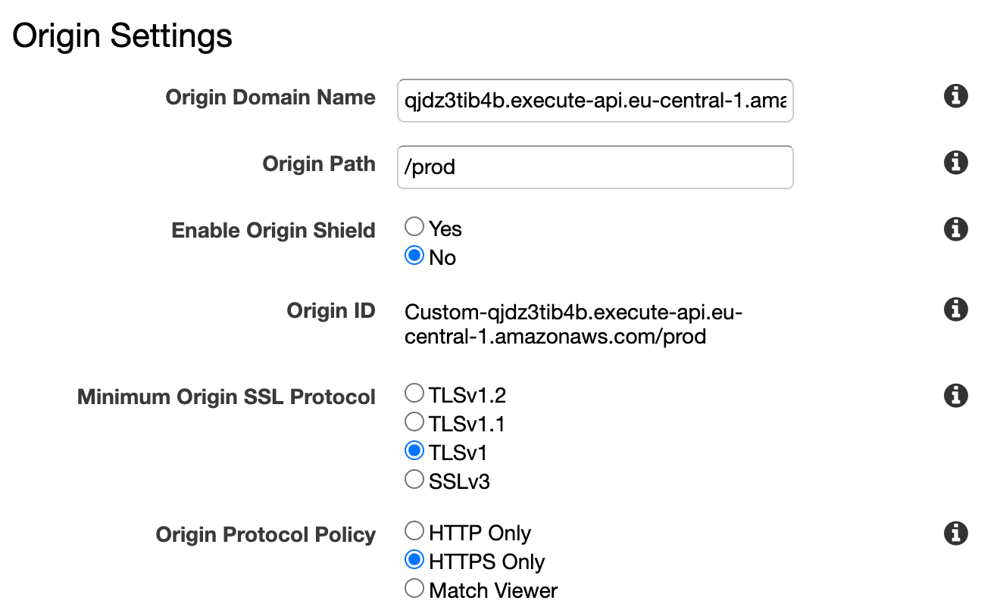

# Introduction

The goal is to create your very own resume and publish it as a public website. For this you are going to use AWS serverless technologies.

The solution will look similar to the following diagram. You will use Amazon S3 static website storage to publish your static site. By using CloudFront, your newly created resume website will be delivered more locally to consumers, thus improving access speed for downloading the content. A nice side effect is that it allows you to securely deliver your website via SSL.

In order for the visitors to get in touch with you, you will need a contact form. Since S3 static website storage does not allow dynamic content, you will make use of AWS Lambda functions to provide this functionality. Completing the form will trigger an AWS Lambda function which in turn sends you an email with the form content. Sending the email is done by using Amazon Simple Email Service. Check out the [Darth Vader](https://darthvader.jhnr.ch) example resume webiste if you want to see it in action.


## Some important side notes

* Since your accounts are only allowed to create resources in the EU (Frankfurt) eu-central-1 region, make sure you change the region accordingly. Always select **region EU (Frankfurt) eu-central-1** to deploy your resource.
* Students cannot create or modify identity and access related configuration in the Powercoders AWS account. Therefor the necessary Lambda execution roles required to complete this lab have already been created for you. In case you are working on this lab in your own AWS account you will need to create the corresponding Lambda execution role and assign it the corresponding policies to access CloudWatch and Amazon SES.

## More information about Cloud and AWS

If you want to get familiar with essential AWS concepts and services. There are plenty of free training sessions available on [AWS training and certification](https://aws.training) or Youtube. You will need a (free) Amazon account for this.

*   [What is Cloud Computing?](https://youtu.be/dH0yz-Osy54) - 5min
*   [What is AWS?](https://youtu.be/a9__D53WsUs) - 5min
*   [AWS Foundations: Getting Started with the AWS Cloud Essentials](https://www.aws.training/Details/Video?id=49639) - 1h

Login with your AWS credentials and get familiar with the [AWS console](https://powercoders.signin.aws.amazon.com/console?region=eu-central-1).

Let the teacher know if you were able to login and browse the AWS console. Check out [this guide](https://docs.aws.amazon.com/awsconsolehelpdocs/latest/gsg/getting-started.html) which will help you to get started with the AWS console.

# Step 1 - Create your HTML resume

First of all you need a resume. Some great examples of static websites built with HTML and CSS can be found [here](https://html5up.net/). All the templates you find there are 100% Free under the [Creative Commons](https://html5up.net/license) license. This means you may use the templates but you need to give HTML5 UP credit for the design. There is a note in the footer section of each template that mentions HTML5 UP.

This lab is based on the [Read Only template from HTML5 UP](https://html5up.net/read-only) so it is recommended to use this one. The template is optimized for a personal website and contains a simple contact form which you are going to use later on.

For this lab we will use a a slightly modified version of the above mentioned template and adopt it to represent your resume. You can download this template from [this github repository](darthvader-resume-template/).

The following modifications were added to the template to match the requirements for this lab:
* To make the contact form work, some JavaScript magic which sends the form input to the AWS API Gateway is needed. Therefor a [JavaScript function](darthvader-resume-template/assets/js/contact.js) was added which will post the message from the contact form to your API. The function requires an API endpoint to be available under `<base url>/rest/contact`. You will create this endpoint as part of this lab.
* The [form definition](https://github.com/sjohner/serverless-resume/blob/5d29ea0e909dedb80c385ade0ffcad6da20fd0bd/darthvader-resume-template/index.html#L113) was slightly modified to call the `sendMessage` function when a user submits the form
* [All form fields](https://github.com/sjohner/serverless-resume/blob/5d29ea0e909dedb80c385ade0ffcad6da20fd0bd/darthvader-resume-template/index.html#L115-L118) are configured as required. When present, this attribute specifies that an input field must be filled out before submitting the form
* The `contact.js` JavaScript file containing the `sendMessage` function is [included in the `index.html`file](https://github.com/sjohner/serverless-resume/blob/5d29ea0e909dedb80c385ade0ffcad6da20fd0bd/darthvader-resume-template/index.html#L150)  

You might want to add a profile pic and some basic information about you. Adjust the `index.html` file accordingly and replace the images in the `images` folder if you want to. To check out your work you can launch `index.html` in your browser on your local machine.

To modify the template you can use whatever text editor you have. There are plenty of options out there which are free to use. Two great options to use are:

*   [Visual Studio Code](https://code.visualstudio.com/)
*   [Sublime Text](https://www.sublimetext.com/)

Don’t spend too much time on your resume. It just serves as an example and you can still tweak it later on when it is online.

# Step 2 - Deploy your resume online

Deploy your resume online as an [Amazon S3 static website](https://docs.aws.amazon.com/AmazonS3/latest/dev/WebsiteHosting.html).

You might want to complete the following training sessions to get some basic understanding of Amazon Simple Storage Service before starting with the actual deployment.

*   [Introduction to Amazon Simple Storage Service (S3)](https://www.aws.training/Details/eLearning?id=32727) - 15min
*   [Foundation of Amazon S3](https://www.aws.training/Details/eLearning?id=32728) - 35min

Whenever you are ready, start creating your resources. You can use [this walkthrough](https://docs.aws.amazon.com/AmazonS3/latest/dev/HostingWebsiteOnS3Setup.html) to get started with static website hosting on Amazon S3

The walkthrough mentioned above is using `example.com` as the name for the S3 bucket. To ensure you can better identify the correct resources later on in the lab, **please make sure you name your S3 bucket according to the following convention:**

```
powercoders-resume-<firstname><lastname> (e.g. powercoders-resume-darthvader)
```

🚨 Some hints regarding the walkthrough:

*   Use `index.html `and `error.html` for your index and error document.
*   When adding the bucket policy which makes your bucket publicly accessible, make sure you replace `example.com` with the name of your bucket. Otherwise you will see an error that says `Policy has invalid resource`
*   In Step 5 of the walkthrough you do not have to create an `index.html` file since this is already present in the website template of this lab. Just upload the content of your website folder including all subfolders

Document the resources you created and let the teacher know the S3 Static Website URL where your resume website is available.

If your resume is available online and you still want to explore Amazon S3 a little more you can [add a custom error document](https://docs.aws.amazon.com/AmazonS3/latest/dev/CustomErrorDocSupport.html) to further personalize your website.

# Step 3 - Logging web traffic

Server access logging provides detailed records for the requests that are made to your bucket.

You can use [this walkthrough](https://docs.aws.amazon.com/AmazonS3/latest/dev/LoggingWebsiteTraffic.html) to get started with server access logging for your static website.

The walkthrough mentioned above is using `logs.example.com` as the name for the S3 bucket. To ensure you can better identify the correct resources later on in the lab, **please make sure you name your S3 bucket according to the following convention:**

```
powercoders-accesslogs-<firstname><lastname> (e.g. powercoders-accesslogs-darthvader)
```

🚨 Some hints regarding the walkthrough:

*   When asked to create a folder for the log files, create one named `logs` for the S3 buckets logs and another one named `cdn `for the CloudFront logs. The `cdn` folder is used in the following steps of this lab
*   Access logging has to be activated on the previously created S3 bucket hosting your resume

Document the resources you created and proceed with the next step of the lab.

# Step 4 - Enable HTTPS for your website

To securly serve your resume website, the S3 website URL should use HTTPS. Since S3 does not support HTTPS connections out of the box you will need to use [Amazon CloudFront](https://aws.amazon.com/cloudfront/) to help with this.

You might want to complete the following training sessions to get some basic understanding of Amazon CloudFront and HTTPS.

*   [What is HTTPS](https://www.cloudflare.com/learning/ssl/what-is-https/)
*   [Introduction to Amazon CloudFront](https://www.aws.training/Details/Video?id=15891) - 10min

Whenever you are ready, start creating your resources. You can use [this walkthrough](https://docs.aws.amazon.com/AmazonS3/latest/dev/website-hosting-cloudfront-walkthrough.html) to get started with securing your website with Amazon CloudFront.

🚨 Some hints regarding the walkthrough:

*   In Step 1 for the `Origin Domain Name` select the correct S3 bucket you created in the previous step.
*   When configuring `Default Cache Behaviour Settings` in Step 5 make sure that you select `Redirect HTTP to HTTPS` for the `Viewer Protocol Policy` \


*   When configuring `Default Cache Behaviour Settings` in Step 5 make sure that you select `GET, HEAD, OPTIONS, PUT, POST, PATCH, DELETE` as the `Allowed HTTP Methods` \



*   Skip steps 6a and 6b in the walkthrough since we are not working with custom domain names for now.
*   When configuring `S3 Bucket for Logs`choose the S3 Log Bucket you created in the previous step.
*   As `Log Prefix` enter `cdn` to make use of the folder you created in the previous step.
*   The creation of the CloudFront distribution point can take up to 5 minutes

You should now be able to securely access your website using the domain name of the newly created distribution point 👍 HTTP requests should be redirected to HTTPS.



Document the resources you created and let the teacher know the CloudFront URL on which your resume website is available.

🥳 Congratulations, you built your static website using Amazon S3 and CloudFront!

# Step 5 - Send emails using Amazon SES

Now that you published your resume, you need a way to get in contact with you. This is where [Amazon SES](https://aws.amazon.com/ses/) comes into play. Amazon Simple Email Service (SES) is a flexible and scalable email service that enables you to send mail from within any application.

Setting up Amazon SES is quite simple:

*   [Verify an email address in Amazon SES](https://docs.aws.amazon.com/ses/latest/DeveloperGuide/verify-email-addresses-procedure.html) to which you want to send your emails. This is probably your own personal email address
*   Check if you are able to send and receive emails by [using the Amazon SES console](https://docs.aws.amazon.com/ses/latest/DeveloperGuide/send-an-email-from-console.html)

Send a test email to your verified email account using the AWS SES console.

# Step 6 - Create a Hello World REST API with Lambda and API Gateway

To be able to POST your contact form content and trigger the sending of an email, you will need to build a corresponding REST API. This can be done using AWS Lambda and Amazon API Gateway.

You might want to complete the following training sessions to get some basic understanding of AWS Lambda and Amazon API Gateway.

*   [What is REST](https://www.codecademy.com/articles/what-is-rest)
*   [Introduction to AWS Lambda](https://www.aws.training/Details/Video?id=16360) - 10min
*   [AWS Lambda Foundations](https://www.aws.training/Details/eLearning?id=27197) - 60min
*   [Introduction to Amazon API Gateway](https://www.aws.training/Details/Video?id=16452) - 10min
*   [Amazon API Gateway for serverless applications](https://www.aws.training/Details/eLearning?id=27199) - 75min

Whenever you are ready, start creating your resources. You can use [this walkthrough](https://docs.aws.amazon.com/apigateway/latest/developerguide/api-gateway-create-api-as-simple-proxy-for-lambda.html) to get started. It will guide you through the process of building a “Hello World” REST API with Lambda and API Gateway.

The walkthrough mentioned above is using `GetStartedLambdaProxyIntegration` as the name for the Lambda function and `LambdaSimpleProxy` as the name for the API Gateway. To ensure you can better identify the correct resources later on in the lab, **please make sure you name your Lambda function according to the following convention:**

Lambda function: `powercoders-helloworld-<firstname><lastname> (e.g. powercoders-helloworld-darthvader)`

API Gateway: `powercoders-resumecontact-<firstname><lastname> (e.g powercoders-resumecontact-darthvader)`

🚨 Some hints regarding the walkthrough:

* Use `Node.js 12.x `as runtime.
* When asked to create a new role instead `Use an existing role` and select the role `powercocers-resumelab-lambdaexecutionrole`. \



* Don't forget to hit `Deploy` after every change to the Function code.
* Make sure that instead of naming your first API resource `helloworld` you create a resource named `rest` and the corresponding `helloworld` resource as a child resource. You will need this `rest` resource later on in this lab. Your resources should look like the following. \


* When deploying your API create a new deployment stage named _prod_ instead of _test_ as outlined in the walkthrough

Document the resources you created let your teacher know the URL where your _Hello World_ REST API can be invoked.

# Step 7 - Send emails using AWS Lambda and API Gateway

Now that you have a working _Hello World_ sample for a REST API with Lambda function, go ahead and adopt the sample to be able to send emails via Amazon SES. [This example from the JavaScript Developer guide](https://docs.aws.amazon.com/sdk-for-javascript/v2/developer-guide/ses-examples-sending-email.html) will help to get you started.

Leave the existing _Hello World_ example as is but create another Lambda function as you did in the previous step. This time, name it according to the following convention:

```
powercoders-sendemail-<firstname><lastname> (e.g. powercoders-sendemail-darthvader)
```

Instead of using the function code provided in the tutorial, get the [code from this Github repository](https://github.com/sjohner/serverless-resume-lab/blob/main/sendmail.js). Make sure you change the following in the function code:

* The sender and recipient address need to match with the email address you registered with Amazon SES.
* Change the `Access-Control-Allow-Origin` header to match with our CloudFront URL. This is necessary because the function is called from another origin - your resume website. See [What is CORS](https://developer.mozilla.org/en-US/docs/Web/HTTP/CORS) for more detailed information about CORS.

After you created your new `sendemail` function, you will have to extend the existing API Gateway with a new resource.

Get back to the walkthrough and create a new resource (Step 4 in the _Create a "Hello, World!" API_ section) as a child of your existing `rest` resource. Instead of naming it `helloworld`, this time name it `contact`.

The contact resource needs some methods. But instead of adding an `ANY` method to the new resource, add the following methods for your newly created `contact` resource:

* OPTIONS
* POST

Now you should have two child resources within your `rest` resource.



🚨 For both methods make sure that you integrate with the new sendemail Lambda function and that you check _Use Lambda Proxy integration_

Once you created and deployed your API, you can now test if you can send emails by using the API. Sample commands for testing the API with curl can be found [here](https://gist.github.com/sjohner/6f521a7b262b1023ce21b9fca042fde9).

# Step 8 - Additional CloudFront origin for the contact API

The HTML contact form and the corresponding javascript to process will be served from your S3 bucket. However the processing of the form will be forwarded to your API Gateway. You will use a convention that anything under the path `/rest/` will be served from API Gateway. The default behavior will be to serve any other requests from our S3 bucket. To serve REST requests from API Gateway you are going to create a second Cloudfront origin.

From the `Origins` tab of your CloudFront Distribution select `Create Origin`. Enter the domain name and path of your API Gateway and make sure to select `HTTPS only` for `Origin Protocol Policy`.



# Step 9 - Test your contact form

You are almost done! Now you can test the contact form of your static website.

Fill the form with some sample data and wait for the email to arrive in your inbox. You can use the [Chrome Developer Tools](https://developers.google.com/web/tools/chrome-devtools) to check what is going on when submitting the form.

🥳 Congratulations, you successfully completed this lab and created your own resume website based on serverless technologies!

# Bonus tasks

Integrate a visitor counter on your website [using AWS Lambda and DynamoDB](https://aws.amazon.com/getting-started/projects/build-serverless-web-app-lambda-apigateway-s3-dynamodb-cognito/module-4/)

Add [Google reCaptcha](https://www.google.com/recaptcha/about/) to protect your website from abuse

If you want to learn more about AWS you might want to check out the [AWS Cloud Practitioner Essentials](https://www.aws.training/Details/Curriculum?id=27076 ) training which prepares you for the [AWS Practitioner exam](https://aws.amazon.com/certification/certified-cloud-practitioner/).
